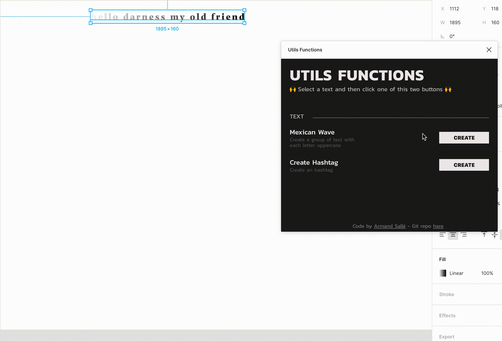

# Plugin Useful Functions for Figma

The plugin can:

- Create a hashtag based on a word or a sentence
- Generate a mexican wave based on a word or a sentence

This is my first plugin and my first TypeScript project. You can add features on it if you want.

## Installation

Create a new plugin in Figma, delete all the files in the new directory that Figma will create and then clone this repo inside.

Then:

1. Install all the dependencies: `npm i`.
2. For development mode: `npm run dev`
3. For production mode: `npm run build`

## Next Features

- [ ] Add more features
- [ ] Improve the UI
- [ ] Refactor code
